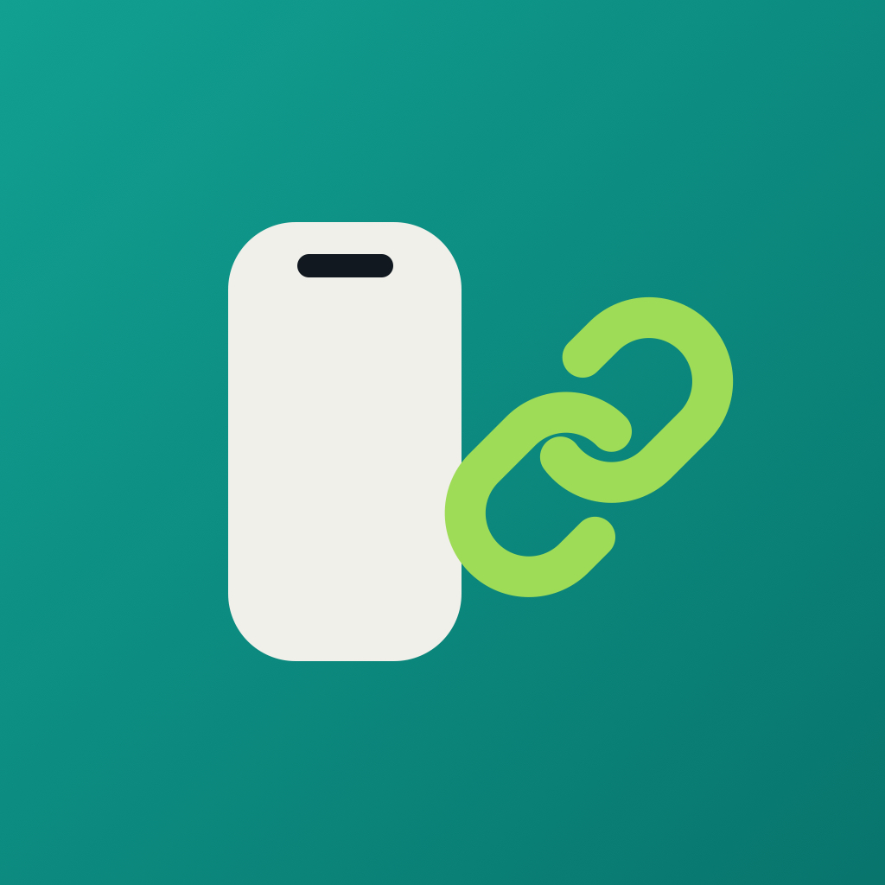
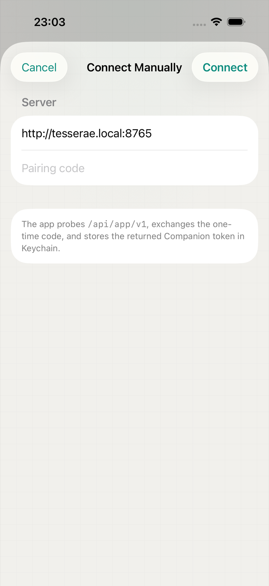
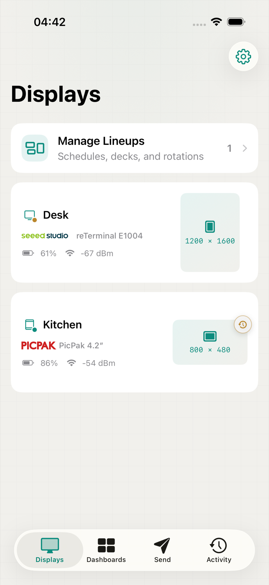
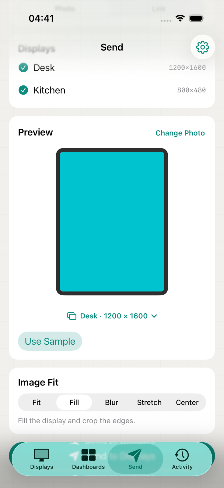
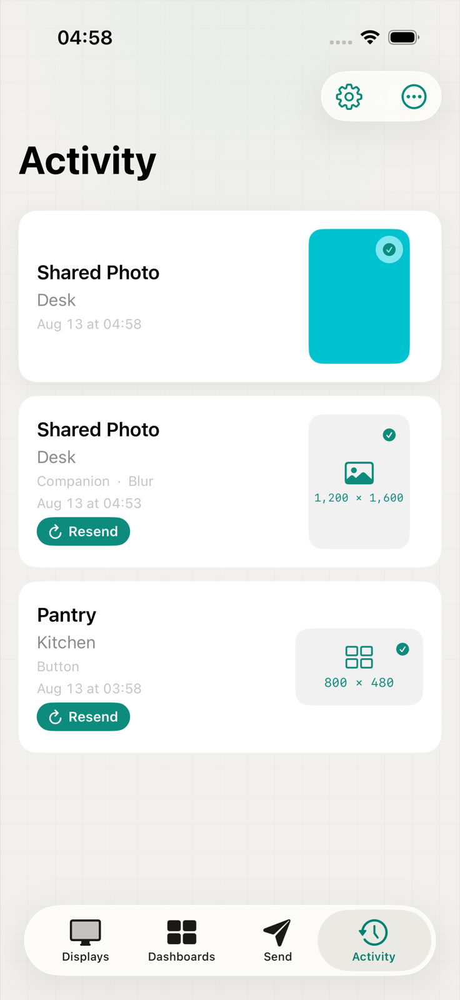
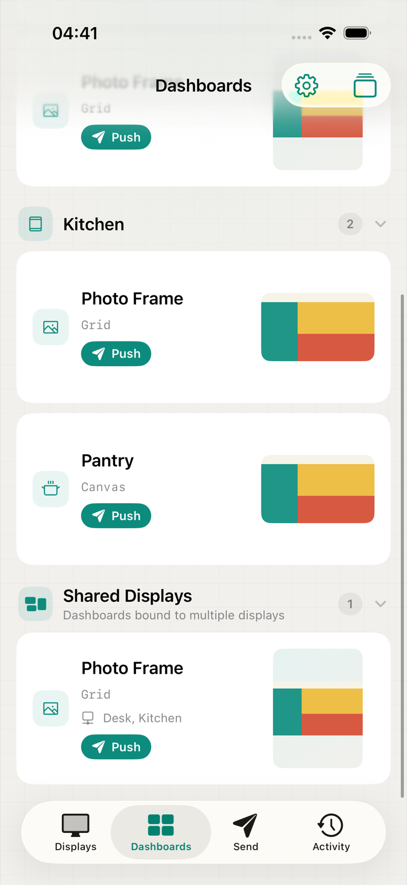
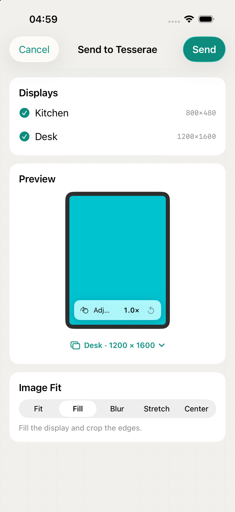
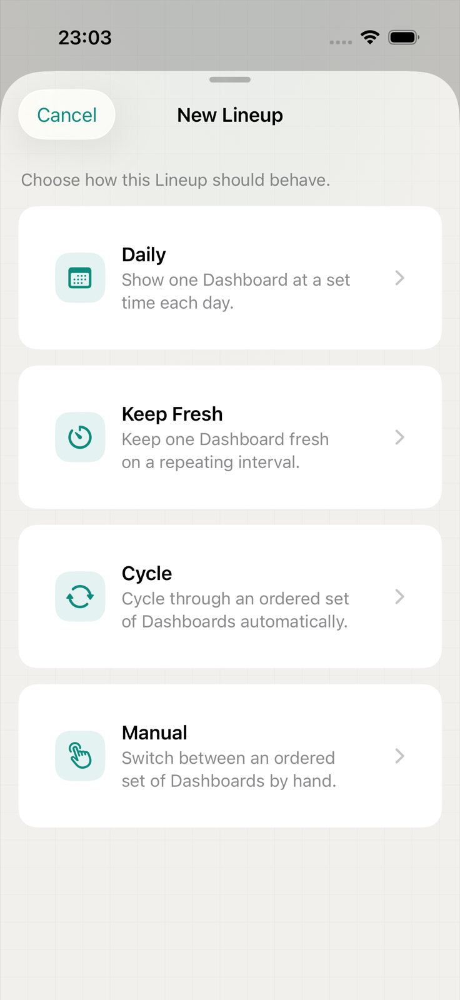
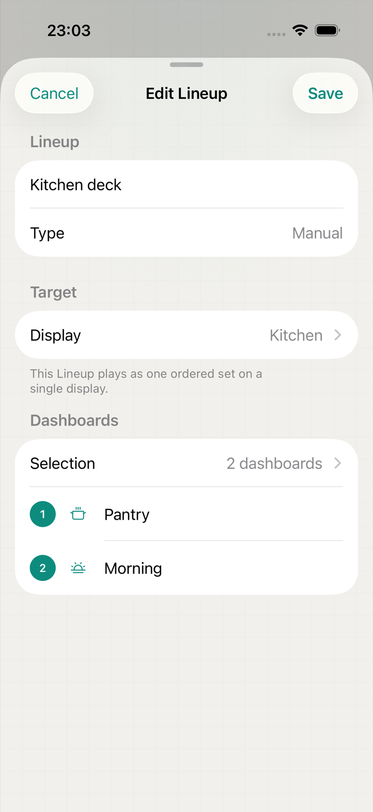

<p align="center">
  
</p>

<h1 align="center">Tesserae Companion</h1>

<p align="center">
  The official native iOS companion for <a href="https://github.com/dmellok/tesserae">Tesserae</a>.<br>
  Control displays, send content, and run everyday actions from your iPhone.
</p>

<p align="center">
  <a href="https://testflight.apple.com/join/gjQar3TK"></a>
  
  
  <a href="LICENSE"></a>
</p>

<p align="center">
  <strong><a href="https://testflight.apple.com/join/gjQar3TK">Join the TestFlight beta</a></strong>
  &nbsp;&middot;&nbsp;
  <a href="https://github.com/dmellok/tesserae">View Tesserae</a>
  &nbsp;&middot;&nbsp;
  <a href="PRIVACY.md">Privacy</a>
</p>

## Made for everyday display tasks

<table>
  <tr>
    <td align="center"><a href="docs/images/readme/pairing.png"></a></td>
    <td align="center"><a href="docs/images/readme/displays.png"></a></td>
    <td align="center"><a href="docs/images/readme/send-photo.png"></a></td>
    <td align="center"><a href="docs/images/readme/activity.png"></a></td>
  </tr>
  <tr>
    <td align="center"><sub><strong>Pairing</strong><br>Connect directly to your server</sub></td>
    <td align="center"><sub><strong>Displays</strong><br>See status and what is showing</sub></td>
    <td align="center"><sub><strong>Send</strong><br>Fit, fill, and frame photos</sub></td>
    <td align="center"><sub><strong>Activity</strong><br>Follow sends and retry content</sub></td>
  </tr>
  <tr>
    <td align="center"><a href="docs/images/readme/dashboards.png"></a></td>
    <td align="center"><a href="docs/images/readme/share-sheet.png"></a></td>
    <td align="center"><a href="docs/images/readme/lineup-create.png"></a></td>
    <td align="center"><a href="docs/images/readme/lineup-editor.png"></a></td>
  </tr>
  <tr>
    <td align="center"><sub><strong>Dashboards</strong><br>Preview and push saved content</sub></td>
    <td align="center"><sub><strong>Share Sheet</strong><br>Send from other iOS apps</sub></td>
    <td align="center"><sub><strong>New Lineup</strong><br>Choose how playback should behave</sub></td>
    <td align="center"><sub><strong>Edit Lineup</strong><br>Update targets and Dashboard order</sub></td>
  </tr>
</table>

Tesserae Companion keeps frequent display interactions close at hand while
leaving authoring and administration in Tesserae's web interface.

- Monitor display health and preview current or upcoming content.
- Browse, preview, and push saved Dashboards.
- Inspect and control server-managed Lineups.
- Send photos, image URLs, and webpage snapshots with display-aware layouts.
- Share an image or link to Tesserae directly from other iOS apps.
- Run common display actions from Shortcuts.
- Bridge selected Apple Reminders data with explicit permission and retention
  controls.

## Your server, your data

The app connects directly to your own Tesserae server. There is no separate
Companion cloud account, and the built-in demo journey works without a server
when you just want to explore the interface.

Personal-data bridges are opt-in. Selected Reminders lists stay on the iPhone;
only the minimal expiring snapshot needed by Tesserae is uploaded. See
[PRIVACY.md](PRIVACY.md) for data flow, storage, permissions, and draft App
Store privacy details.

## Get the beta

1. Install [TestFlight](https://apps.apple.com/app/testflight/id899247664) on
   your iPhone.
2. [Join the Tesserae Companion beta](https://testflight.apple.com/join/gjQar3TK).
3. Open the app and discover a Tesserae server on your local network, or enter
   its address manually.
4. Pair with the code shown by Tesserae.

Tesserae Companion requires iOS 18 or later. The core app expects a Tesserae
server with the scoped `/api/app/v1` surface; optional features are shown only
when the server advertises their capabilities. The current compatibility and
physical-validation record lives in [COMPATIBILITY.md](COMPATIBILITY.md).

## Product scope

The native app focuses on quick household interactions: Displays, Dashboards,
Lineups, Send, Activity, Share Sheet, Shortcuts, and privacy-controlled personal
data bridges.

Dashboard creation, Canvas editing, plugins, themes, schedules, rotations,
firmware, and advanced device management remain in Tesserae's web UI. The
planned first App Store release is 1.0.0; the public build is currently an
external TestFlight beta.

## Development

The repository contains a native Swift 6 and SwiftUI application generated with
[XcodeGen](https://github.com/yonaskolb/XcodeGen). `TesseraeKit` owns the shared
models, Keychain boundary, and HTTP transport.

```text
App/
├── Sources/
│   ├── Features/
│   └── DesignSystem/
└── Resources/
Packages/
└── TesseraeKit/
    ├── Sources/TesseraeKit/
    └── Tests/TesseraeKitTests/
ShareExtension/
Contracts/
project.yml
```

Generate and open the Xcode project:

```sh
xcodegen generate
open TesseraeCompanion.xcodeproj
```

Run the Swift package and OpenAPI fixture tests:

```sh
swift test --package-path Packages/TesseraeKit
python -m pytest Contracts
```

Run the stateful local contract server for the manual-connection and UI-test
journeys:

```sh
python3 Contracts/fixture_server.py --port 8765
```

Then connect to `http://127.0.0.1:8765` with any six-digit pairing code. This
fixture is development infrastructure, not a Tesserae server.

The app includes Simplified Chinese resources, privacy manifests, and an
embedded Share Extension. English remains the development language. Automatic
signing is configured for the maintainer's Apple Developer team; Xcode must be
signed into that team before it can create development provisioning profiles.

## Documentation

| Document | Purpose |
| --- | --- |
| [DESIGN.md](DESIGN.md) | Product, UX, architecture, and acceptance criteria |
| [API_CONTRACT.md](API_CONTRACT.md) | Companion server contract and ownership boundaries |
| [Contracts/app-v1.openapi.yaml](Contracts/app-v1.openapi.yaml) | Machine-readable API contract |
| [COMPATIBILITY.md](COMPATIBILITY.md) | Capability gates and validation evidence |
| [PRIVACY.md](PRIVACY.md) | Local data flow, retention, and permissions |
| [TESTFLIGHT_CHECKLIST.md](TESTFLIGHT_CHECKLIST.md) | Beta release checks |
| [TESTFLIGHT_NOTES.md](TESTFLIGHT_NOTES.md) | Tester guidance and beta metadata |
| [CHANGELOG.md](CHANGELOG.md) | Notable user-visible changes |
| [CONTRIBUTING.md](CONTRIBUTING.md) | Contribution and contract-change workflow |
| [SECURITY.md](SECURITY.md) | Security reporting |
| [ATTRIBUTION.md](ATTRIBUTION.md) | Tesserae name, mark, and upstream boundaries |

Contract changes should be discussed with the Tesserae maintainer and recorded
in the API contract before the app depends on them. A proposed API is not a
compatibility guarantee until the matching Tesserae release and minimum server
version are documented.

## Repository boundary

The iOS app lives in this repository because it has a separate Xcode, signing,
App Store, issue, and release lifecycle from the Tesserae server. The Tesserae
repository owns the server implementation, server-facing OpenAPI integration,
and server contract tests.

Tesserae's maintainer has designated **Tesserae Companion** as the official iOS
app and granted permission to use the Tesserae name and mark subject to the
boundaries in [ATTRIBUTION.md](ATTRIBUTION.md).

## Licence

Tesserae Companion's original code and documentation are available under the
[Apache License 2.0](LICENSE). Tesserae is a separate project under
AGPL-3.0-or-later; this client licence does not change the Tesserae server's
licence or grant additional rights to its name and marks.
